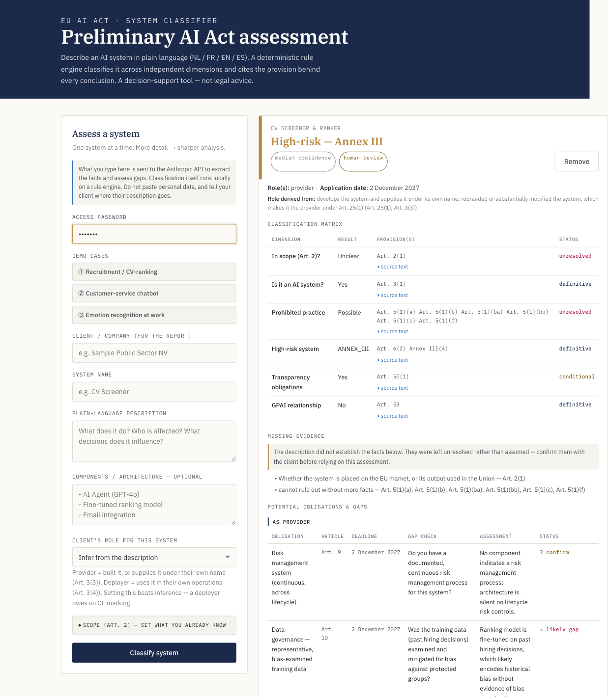

# EU AI Act Audit Tool

You describe an AI system in plain language — what it does, who it affects —
and the tool tells you which parts of the EU AI Act apply to it, what your
legal duties are, and where the gaps in your compliance evidence are.



No API key handy? [`docs/sample-assessment.pdf`](docs/sample-assessment.pdf) is
a real generated report from this session — open it directly.

## Why it's built this way

**The LLM never decides the classification.** Claude only extracts structured
facts from the description (`src/facts.py`); a deterministic Python rule
engine (`src/rules.py`) applies the law to those facts and returns the tier,
the roles, and the obligations, each one citing the provision it came from.
Ask it the same facts twice and you get the same answer twice — the
classification is unit-testable and the reasoning is inspectable, not a
paragraph of prose to take on faith.

The cost is upfront and ongoing engineering, not prompting. Every provision
the tool can reason about — each Annex III domain, each Art. 5 exception, the
GPAI systemic-risk threshold — had to be explicitly hand-coded before the
engine could apply it. Coverage is exactly what's been modeled: administrative
fines (Art. 99) aren't in `rules.py`, so the tool is silent about them, where
an LLM asked to classify directly might have said *something* — right or
wrong. And when the law changes, as the 2026 Digital Omnibus amendment did,
fixing it means changing code and re-running the test suite, not adjusting a
prompt.

## Quickstart

Needs Python 3.12+ (tested on 3.12.9) and Node 18+ (tested on v26). Every
command below was run from a clean clone during this session.

```bash
cd "EU Act"
python -m venv .venv && source .venv/bin/activate
pip install -r requirements.txt

cp .env.example .env              # paste your Anthropic API key into .env

python src/fetch_law.py           # download the EU AI Act text (~4s, no key needed)
python src/ingest.py              # build the local vector store (~20s here; first run
                                   # also downloads the ~470MB multilingual-e5 model)

APP_PASSWORD=yourpassword uvicorn api:app --app-dir src --port 8090
```

Frontend (the only UI):

```bash
cp web/.env.example web/.env.local   # BACKEND_URL=http://localhost:8090
npm --prefix web install
npm --prefix web run dev             # http://localhost:3000
```

Everything above runs with no Anthropic key: fetching the law, building the
index, the test suite, and `npm run build`. Only `/classify` and `/report` —
the endpoints that call Claude — need `ANTHROPIC_API_KEY`. One classification
is two Claude calls (fact extraction + gap assessment) and took **~12 seconds**
wall-clock in this session's testing; no cost figure is quoted here because
none has been measured — see `docs/DEPLOY.md` for spend controls and a budget
alert.

### Data handling

Embeddings and the vector store are local. **The system description and
component list are sent to the Anthropic API** for fact extraction and gap
assessment — client data does leave the machine. Tell clients this, and avoid
pasting personal data into descriptions.

## Architecture

```
             Next.js UI (web/) → FastAPI (api.py)
                             │
                             ▼
             facts.py  — LLM extracts structured Facts only
                             │        ▲
                             │   retriever.py → ChromaDB (local)
                             │        ▲   multilingual-e5 (local, free)
                             │   ingest.py ← knowledge/*.md + data/*.txt
                             ▼
             rules.py  — deterministic rule engine → Assessment
                             │
             citations.py — verbatim operative text per provision
                             │
             gaps.py   — LLM judges gaps against the architecture
                             ▼
             report_v2.py — branded PDF with sources
```

Module-by-module breakdown and the full request path: **[docs/ARCHITECTURE.md](docs/ARCHITECTURE.md)**.

## Testing

```bash
pytest
```

**304 tests, no API key needed** — the rule engine is pure Python, so it's
tested directly against labelled facts, not through the LLM. Runs in under 10
seconds.

Fact-extraction accuracy (the part that does call Claude) is measured
separately against 80 labelled descriptions in `eval/`. Headline number from
the held-out set: **97.1% field accuracy (95% CI 91.9–99.0%, n=104)**. Full
methodology, what's statistically proven versus merely consistent with the
targets, and what the numbers don't establish: **[docs/EVALUATION.md](docs/EVALUATION.md)**.

## Status and limits

**Done:** territorial scope (Art. 2), AI-system definition, all Art. 5
prohibitions including the 2026 Omnibus insertions, Annex I/III high-risk
classification, Art. 50 transparency duties, GPAI provider duties split from
downstream-provider status, role derivation (provider/deployer/importer),
per-obligation gap assessment, and a cited PDF report.

**Partial:** the eval set proves field accuracy but not yet the tier-exact or
under-warning gates at the target confidence — see `docs/EVALUATION.md` for
exactly how many more labelled cases that needs.

**Not built:** administrative fines (Art. 99) are not modeled anywhere, so the
report never mentions them. Downstream GPAI provider duties beyond the
Art. 3(68) distinction are not fully modeled. National implementing law is out
of scope. This is a compliance-planning aid, not legal advice or a conformity
assessment under Art. 43. See Data handling above for what leaves the machine.

## More

- [docs/ARCHITECTURE.md](docs/ARCHITECTURE.md) — module-by-module + request path
- [docs/EVALUATION.md](docs/EVALUATION.md) — full evaluation methodology
- [docs/DEPLOY.md](docs/DEPLOY.md) — Cloud Run + Vercel deployment
